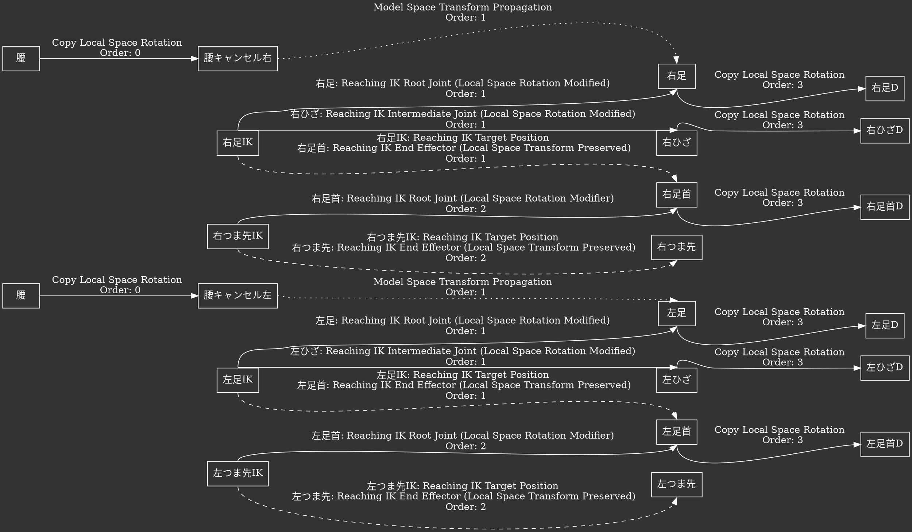

## Brioche Asset Import  

  

[Khronos ANARI: glTF To ANARI](https://github.com/KhronosGroup/ANARI-SDK/blob/next_release/src/anari_test_scenes/scenes/file/gltf2anari.h)  
[Khronos ANARI: Hydra ANARI Render Delegate](https://github.com/KhronosGroup/ANARI-SDK/blob/next_release/src/hdanari/renderDelegate.h)  
[Pxiar OpenUSD: Hydra Storm Render Delegate](https://github.com/PixarAnimationStudios/OpenUSD/blob/dev/pxr/imaging/hdSt/renderDelegate.h)  

- [x] Scene  
  - [x] glTF  
- [ ] Mesh
  - [ ] PMX 
- [ ] Animation 
  - [ ] VMD  
- [x] Image  
  - [x] DDS  
  - [x] PVR  
  - [ ] PNG  
  - [ ] JPEG  

### PMX

[TDA Miku Append](https://mikumikudance.fandom.com/wiki/Miku_Hatsune_Append_(Tda))  

// everything happens in local space  

// append transform (append OFF: animated transform + IK / append ON: append transfrom (do we stil need to consider IK in this situation?))  

// we copy the offset bias from the bind pose or the absolute value?  

// copy rotation bone constraint  
// copy translation bone constraint  

Apply Append Transform to Local Transform  

Sync from Local Space to Model Space  

Note: the Reaching IK does NOT change the local transform of the Tail joint (end effector)  

// can we ignore the (animation input source) rotation of the local transform of the chain when IK is enabled // (when no limit)  // the initial state matters for iteration  

